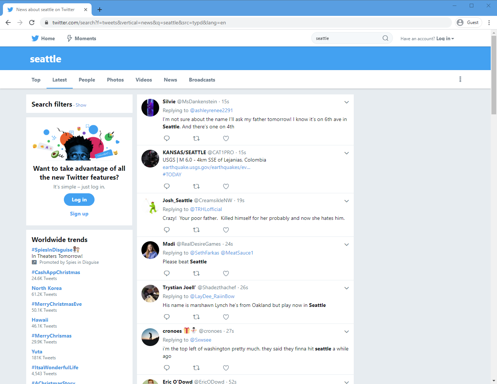
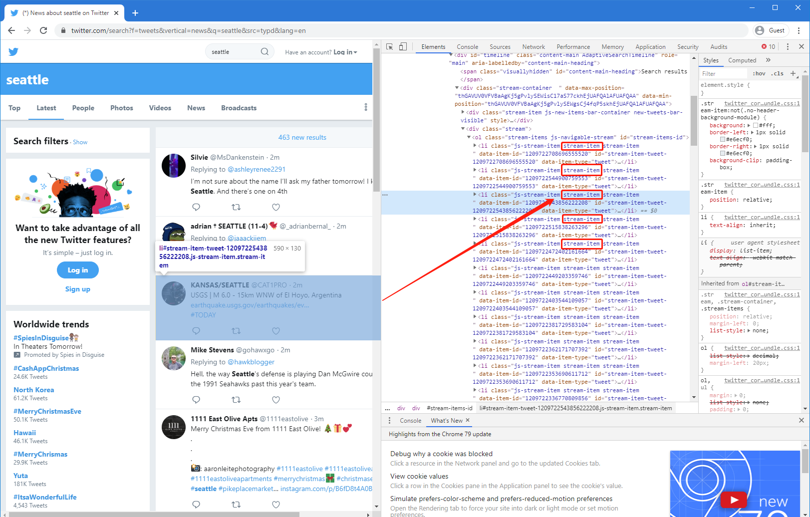

# Praticial Exercise 2: Twitter data collection using web crawler

**Meeting:** Wednesdays, 2:30 - 5:20, SMI 109

**Instructor:** Bo Zhao, SMI 416B, Office hours by appointment

**Contact:** 206.685.3846, zhaobo@uw.edu, jakobzhao (skype/wechat)

In this pratical exercise, we will introduce how to collect Twitter data using a web crawler. A web crawler is a purposely designed bot for online data collection. In most cases, online data can be acquired through a dedicated API maintained by the data provider. If no avaliable API, we can use a crawler library (e.g. Selenium, Scrapy, etc.) to develop a customized crawler. Below, we will develop two crawlers to harvest twitter data. The first one is made with a python library named 'Selenium'; and the other one tries to collect data from Twitter API. Okay, let us get started!

# 1. Environment setup

To setup the working environment, you will need to install Anocanda and PyCharm.

**Python:** is an interpreted, high-level, general-purpose programming language. Its language constructs and object-oriented approach aim to help programmers write clear, logical code for small and large-scale projects. Please install a python library, the version of which needs to be greater than 3.0.

Instead of installing Python, you can install  **Anaconda** - a customized python wrapper for  for scientific computing (data science, machine learning applications, large-scale data processing, predictive analytics, etc.), that aims to simplify package management and deployment. Package versions are managed by the package management system conda. The Anaconda distribution includes data-science packages suitable for Windows, Linux, and MacOS. Check https://www.anaconda.com/distribution/ to download an Anaconda package. Please make sure you choose the Python 3.X version.

**PyCharm:** is an integrated development environment (IDE) for the Python language. It is developed by the Czech company JetBrains. It provides code analysis, a graphical debugger, an integrated unit tester, integration with GitHub, and supports web development as well as Data Science with Anaconda. PyCharm is cross-platform, with Windows, macOS and Linux versions. The Community Edition is released under the Apache License, it is free to use. Check https://www.jetbrains.com/pycharm/ to download and install PyCharm.

The exercise will highly depend on your proficiency on using PyCharm, if you are not familiar with it, please walk over the following tutorials:

- [Create and run your first Python project](https://www.jetbrains.com/help/pycharm/creating-and-running-your-first-python-project.html);
- [Debug your first Python application](https://www.jetbrains.com/help/pycharm/debugging-your-first-python-application.html); and
- Skim over this tutorial on [using git on PyCharm](https://www.jetbrains.com/help/pycharm/using-git-integration.html).

# 2. Develop a generic Twitter crawler using Selenium

In this section, we will make a generic web cralwer. As a generic crawler, the same developing procedure can be applied to crawling data from any website. This crawler manipulates a browser using a python library named "Selenium". This library enables the crawler mimic how a human user visits and/or interacts with web pages. While viewing the web pages, the crawler monitors the data flows, parses the html structure, and extracts the requested data items. Below, we will introduce how to design a crawler to collect tweets of a specific topic.

Above all, please install two required python libraries, in terms of selenium and BeautifulSoup. Selenium is the library to manipulate web browser, and beautifulSoup is for destructuring html pages. To install, please execute the following script on command prompt (if a windows user) or terminal (if a Mac or Linux user).

```powershell
pip install selenium
pip install beautifulsoup4
```

Once you have these two libraries installed, please try to execute the script [`01_twsearch.py`](01_twsearch.py) under the [02_cyber folder](./) on PyCharm. We will give a step-by-step instructon of this piece of python script.


```python
# created on Dec 24, 2020
# @author:          Bo Zhao
# @email:           zhaobo@uw.edu
# @website:         https://hgis.uw.edu
# @organization:    Department of Geography, University of Washington, Seattle
# @description:     Search tweets of a specific topic using a web crawler
```

For any python script, metadata are usually stated at the very beginning.

```Python
from selenium import webdriver
from bs4 import BeautifulSoup
import time, datetime, json
```

Follwing the metadata, the required python libraries for this crawler will be included. In addition to selenium and beautifulsoup4, time and dateime are imported to manage the execution of this script, and json will enable us to parse any json data

```Python
url = "https://twitter.com/search?f=tweets&vertical=news&q=seattle&src=typd&lang=en"
```

If you input this url to a chrome browser, a twitter search interface showing results related to "Seattle" will be listed. In fact, you can update the keyword between `q=` and `&` to search any topic you like, for example, a celebrity, a natural disaster, latest news, etc. Obviously, you can rely on the same strategy to identify web pages other than Twitter.



```Python
url = "https://twitter.com/search?l=&q=near%3A%22houston%22%20within%3A15mi%20since%3A2017-08-24%20until%3A2017-08-31&src=typd&lang=en"
```

In addition to just searching a keyword, you can also compose a more advanced search including location, time period, and hashtags. As listed above, the url tries to search all the tweets within a buffer centering Houston and with a radius of 15 miles, also the collected tweets were created between August 24 to 31, 2017.


```Python
bot = webdriver.Chrome(executable_path="assets/chromedriver.exe") # if you are a mac user, please use "assets/chromedriver"
bot.get(url)
```

Next, a bot is created with a browser driver. Selenium requires a driver to interface with the chosen browser. Most of the browsers such as Chrome, Edge, Firefox or Safari, provide drivers. Chrome driver will be used in this practical execerise. Check [https://sites.google.com/a/chromium.org/chromedriver/downloads](https://sites.google.com/a/chromium.org/chromedriver/downloads) to download a chrome driver. Also, we have the current version of chromedriver saved in the [assets folder](assets/). the parameter exectuable_path must point to the path of the driver. Once a chromedriver is set up, you can get the web page using the bot's `get` method.


```Python
f = open("assets/tweets.csv", "a", encoding="utf-8") # create a csv file to store the collected tweets.
f.write('user_id, user_name, screen_name, status_id, created_at, time_integer, reply_num, retweet_num, favorite_num, content \n') # read the csv header
start = datetime.datetime.now() # record the current time.
time_limit = 60 # this crawler will run 60 minutes
texts = [] # an array to store each content of the collected tweets.
```

Declare global variables and assign initial values, such as creating an empty csv file, writing a header to the csv file, and recording the current time, and so on.

```Python
while len(bot.find_elements_by_xpath('//div[contains(text(), "Back to top ↑")]')) != 1:
    time.sleep(5)
    bot.execute_script("window.scrollTo(0, document.body.scrollHeight);")
    soup = BeautifulSoup(bot.page_source, 'html5lib')
    tweets = soup.find_all('li', class_="stream-item")[-20:] # only process the newly-acquired tweets.
    if int((datetime.datetime.now() - start).seconds) >= time_limit: # if longer than a minute, then stop scrolling.
        break
    # parsing each tweet of the tweets
```
Twitter search interface only shows part of the result, but if you keep scrolling down the page, you can read more till the end of page. At this moment, you will see a notice at the bottom of the page `Back to top ↑`. For each scroll, we will rest 5 seconds. Another criteria to stop the cralwer is the time limit. If the crawler has executed longer than the predefined limit time, the crawler will stop too.

There are mutiple strategies to locate an element using **Selenum's webdriver**. For example:

```python
find_element_by_id
find_element_by_name
find_element_by_xpath
find_element_by_link_text
find_element_by_partial_link_text
find_element_by_tag_name
find_element_by_class_name
find_element_by_css_selector
```

To find multiple elements (these methods will return a list):

```python
find_elements_by_name
find_elements_by_xpath
find_elements_by_link_text
find_elements_by_partial_link_text
find_elements_by_tag_name
find_elements_by_class_name
find_elements_by_css_selector
```

To get more about using these locating strategies, please refer to [https://selenium-python.readthedocs.io/locating-elements.html](https://selenium-python.readthedocs.io/locating-elements.html).

In addition to selenium, **Beautiful Soup** is also very important for destructuring html pages.Beautiful Soup is a Python library for pulling data out of HTML and XML files. It provides idiomatic ways of navigating, searching, and modifying the parse tree. If you are not fimiliar with Beautiful Soup, please go over the [`Quick Start` section of this documentation](https://www.crummy.com/software/BeautifulSoup/bs4/doc/#quick-start).




To develop the locating strategy, we can use Chrome's Inspector to visually explore the elements of the opened web page and its corresponding source code. As shown in the screenshot below, we find out all the tweet items are wrapped in a `li` elmenent, and with a class named `stream-item`, then we can retrieve all the tweet items by looking for all the `li` elments having a class named `stream-item`.

**Note:** To open an inspector on Chrome, you can right click on the displaying web page. On the pop-up dropdown menu, click `Inspect`, and then the inspector will show up.

```Python
for tweet in tweets:
      try:
          user_json = json.loads(tweet.div.attrs["data-reply-to-users-json"])
          user_id = int(user_json[0]['id_str'])
          user_name = user_json[0]['screen_name']
          screen_name = user_json[0]['name']
          status_id = int(tweet.attrs["data-item-id"])
          text = tweet.find("p").text.strip().replace("\n", "")
          created_at = tweet.find("small", class_="time").a.attrs["title"]
          time_integer = tweet.find("small", class_="time").a.span["data-time-ms"]
          reply_num = tweet.find("div", class_="ProfileTweet-action--reply").find("span", class_="ProfileTweet-actionCountForPresentation").text
          retweet_num = tweet.find("div", class_="ProfileTweet-action--retweet").find("span", class_="ProfileTweet-actionCountForPresentation").text
          favorite_num = tweet.find("div", class_="ProfileTweet-action--favorite").find("span", class_="ProfileTweet-actionCountForPresentation").text
          inst_url = ""
          if "www.instagram.com" in text:
              inst_url = tweet.p.a.attrs["title"]
          ...
          ...
      except:
          pass
```

For each tweet, we try to extract infomation about the author, the tweet, and identify whetehr it is a tweet synchronized from Instagram. Notably, the line feeds are deleted in the text.


```Python
for tweet in tweets:
      try:
          ...
          text = tweet.find("p").text.strip().replace("\n", "")
          ...
          record = '%d, %s, %s, %d, %s， %s， %s， %s， %s， %s \n' % (user_id, user_name, screen_name, status_id, created_at, time_integer, reply_num, retweet_num, favorite_num, text)
          print(record)
          if (text not in texts):
              f.write(record)
          texts.append(text)
```

`f.write(record)`


https://twitter.com/search?q=seattle&src=typed_query&f=live

# 3. Develop a Twitter crawler upon Twitter API


twitter search
