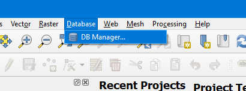
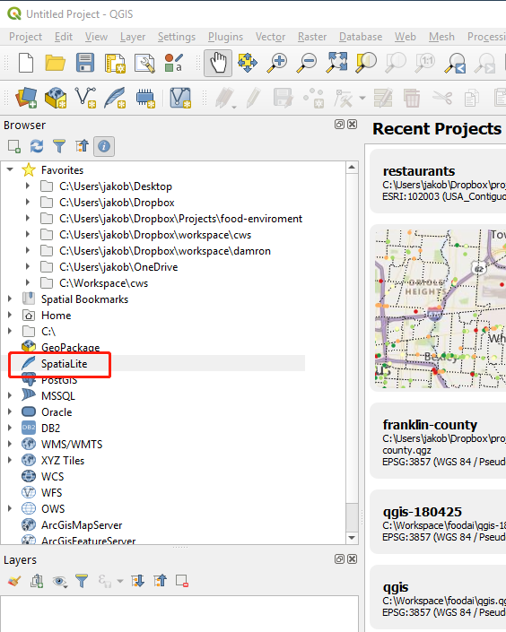
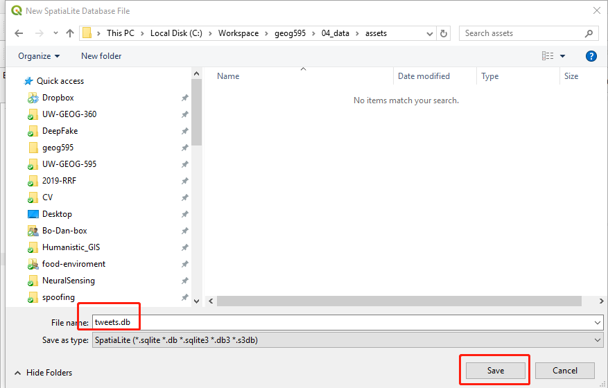
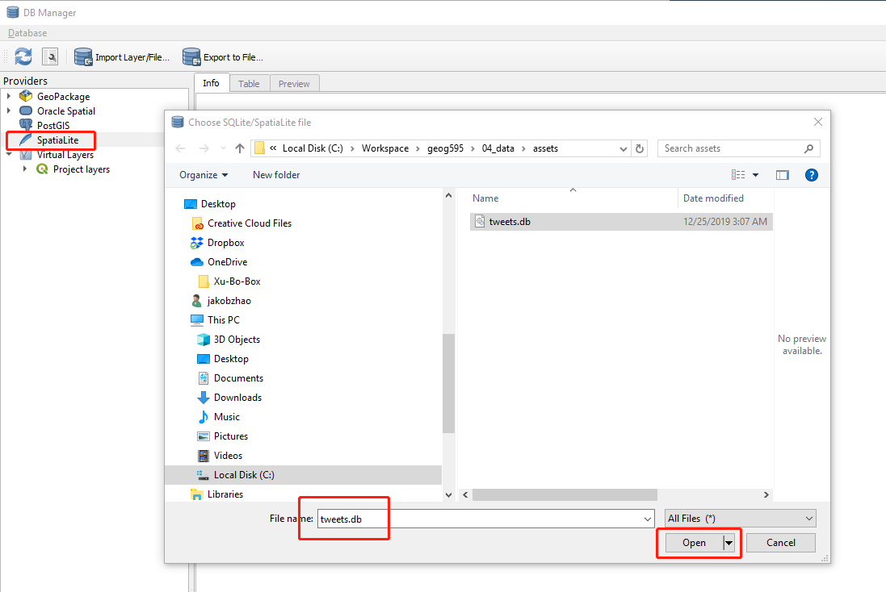
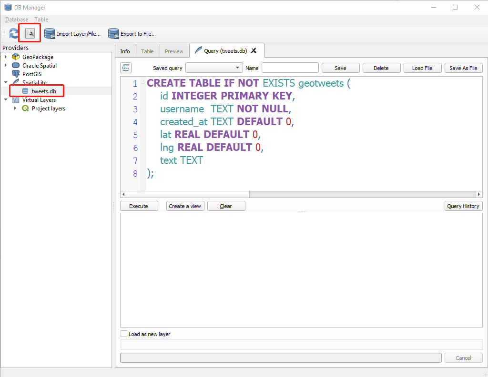

# Spatial database management using SpatiaLite

**Meeting:** Wednesdays, 2:30 - 5:20, SMI 109

**Instructor:** Bo Zhao, SMI 416B, Office hours by appointment

**Contact:** 206.685.3846, zhaobo@uw.edu, jakobzhao (skype/wechat)


In this practical execerise, we introduce how to manage a spatial database using spatialite. In the GIS industry, there are multiple spatial databases, such as geodatabase, postgresql(with postgis), Oracle, and spatialite. These databases are designed for database of different size and in different uages. Spatialite is a file based database, derived from sqlite and supported by a few open source GIS libraries. Spatailite can be used for mobile development and in cross platform. Since Spatialite can manage both spatial data tables and common attribute data tables in a single database file, it actually makes the geospatial data management much easier if compared with Shapefiles. Besides, SpatiaLite has extended the common SQL functions and supported a series of spatial functions to support advanced spatail queries or joins. Below, the practical exercise will allow the users to learn how to create a spatialite database, to create data table, to insert geospatial data, and eventually visualizes and analyses the geospatial data. This execerise actually extends the [`02_geosearch.py`](../03_bot/02_geosearch.py) from the praticial exercise of last week, the harvested data will save in a spatialite database instead of a csv file.  Okay, let us get started!


## 1. Environment setup

To setup the working environment, you will need to install QGIS (version > 3.0). We assume you have already install Anocanda and PyCharm. QGIS is an integrated GISystem, which has been considered as the open source alternatives to ArcGIS. To install QGIS, make sure its version is greater than 3.0. Please download it from [https://qgis.org/en/site/forusers/download.html](https://qgis.org/en/site/forusers/download.html). In this pratical exercise, we mainly use its `DB Manager` function for spatial data operations.




## 2. Manage geospatial database using SpatiaLite

### 2.1 Install Prerequisite python libray

Above all, please install one required python libraries - sqlite3. To install, please execute the following script on command prompt (if a windows user) or terminal (if a Mac or Linux user).

```powershell
pip install sqlite3
```

Once installed, please try to execute the script [`tw2db.py`](tw2db.py) under the [04_data folder](./) on PyCharm. We will offer a step-by-step instructon of this piece of python script.

### 2.2 Create a spatialite database

The most convenient way to create a spatialite database is using QGIS. Open a QGIS (version >3.0) application. In the browser panel on the left, please right-click the SpatiaLite icon. In the pop-up dropdown menu, press `Create Database...`. The name of this database is `tweets.db`.



After inputing the database name and navigate to where to store this database, an empty spatial datbase is generated.



## 2.3 Database Initialization

In order to use this database, we will do several queries to build a data table within the database. The sql statement can be found in [`create_table.sql`](create_table.sql).

Navigate from `Database` on the main menu bar to `DB Manager...`. In the pop-up interface, Right-click the SpatiaLite item on the provider panel to build a new connection. This `New Connection` will conect to `tweets.db`.




On the DB Manger interface, Navigate from `Database` on the main menu, and then open up the `SQL window.` In the popup window, please input the first SQL statement, and press `Execute`.

l.,,


Once executed, a new table named `geotweets` is created. This data table has several fields, such as id, username, created_at, lat, lng, and text.


## 2.3 Data Collection

Having the data streamed in, we will then store each row to the newly created spatialite database.

```python

def on_data(self, data):
    """This is called when data are streamed in."""

    conn = sqlite3.connect(self.dbfile)
    cursor = conn.cursor()

    if (time.time() - self.start_time) < self.limit:
        ...
        text = datajson['text'].strip().replace("\n", "").replace('"', '\"').replace("'", "\"")
        ...
        ...
        record = (id, username, created_at, lng, lat, text)
        insert_record_sql = "INSERT INTO geotweets (id, username, created_at, lng, lat, text) VALUES (%d, '%s', '%s', %f, %f, '%s')" % (id, username, created_at, lng, lat, text)
        cursor.execute(insert_record_sql)
        conn.commit()
        print (record)
    else:
        conn.close()
        print ("finished.")
        return False
```
As shown, a database connection is built. And the `cursor` allows to excute SQL statement, and then a change commit is implemented just after the cursor execute the SQL statement.

In this way, a common data table is created. At this moment, users might not directly notice this small change.


## 2. Deliverable

In this pratical exercise, you are excepted to walk through the instruction, execute the two pieces of python scripts, and more importantly, develop your own crawler to collect some data from the web. Ideally, this data will be related to research question you have stated in your [statement of intent](../01_intro/soi.md).

To submit your deliverable, please create a new github repository, and submit the url of the GitHub to the **Canvas Dropbox** of this pratical exercise. The file structure of this github repository should look like below.

```powershell
[your_repository_name]
    │ [your_crawler].py
    │readme.md
    ├─assets
    │      tweets.csv
    │      geotags.csv
    │      [your_dataset].csv
```

Here are the grading criteria:

1\. Execute both `01_twsearch.py` and `02_geosearch.py` with different keywords, and save the results to `tweets.csv` and `geotags.cvs` in the `assets` folder of the newly-created repository. (POINT 5 for each)

2\. Develop a web crawler to harvest data from a website other than Twitter. This python script should save in the root of the repository. (POINT 20)

3\. Export a sample of the results to the `assets` folder of the repository. (POINT 5)

4\. In the `readme.md` file, write an instruction to introduce the crawler and its usages. You can refer to  [https://github.com/shawn-terryah/Twitter_Geolocation](https://github.com/shawn-terryah/Twitter_Geolocation). (POINT 15)


**Note:** Lab assignments are required to be submitted electronically to Canvas unless stated otherwise. Efforts will be made to have them graded and returned within one week after they are submitted.Lab assignments are expected to be completed by the due date. ***A late penalty of at least 10 percentage units will be taken off each day after the due date.*** If you have a genuine reason(known medical condition, a pile-up of due assignments on other courses, ROTC,athletics teams, job interview, religious obligations etc.) for being unable to complete work on time, then some flexibility is possible. However, if in my judgment you could reasonably have let me know beforehand that there would likely be a delay, and then a late penalty will still be imposed if I don't hear from you until after the deadline has passed. For unforeseeable problems,I can be more flexible. If there are ongoing medical, personal, or other issues that are likely to affect your work all semester, then please arrange to see me to discuss the situation. There will be NO make-up exams except for circumstances like those above.
