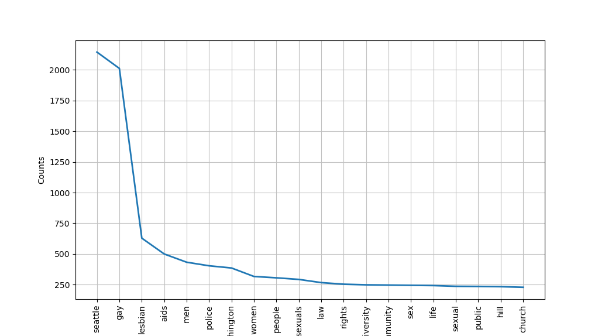
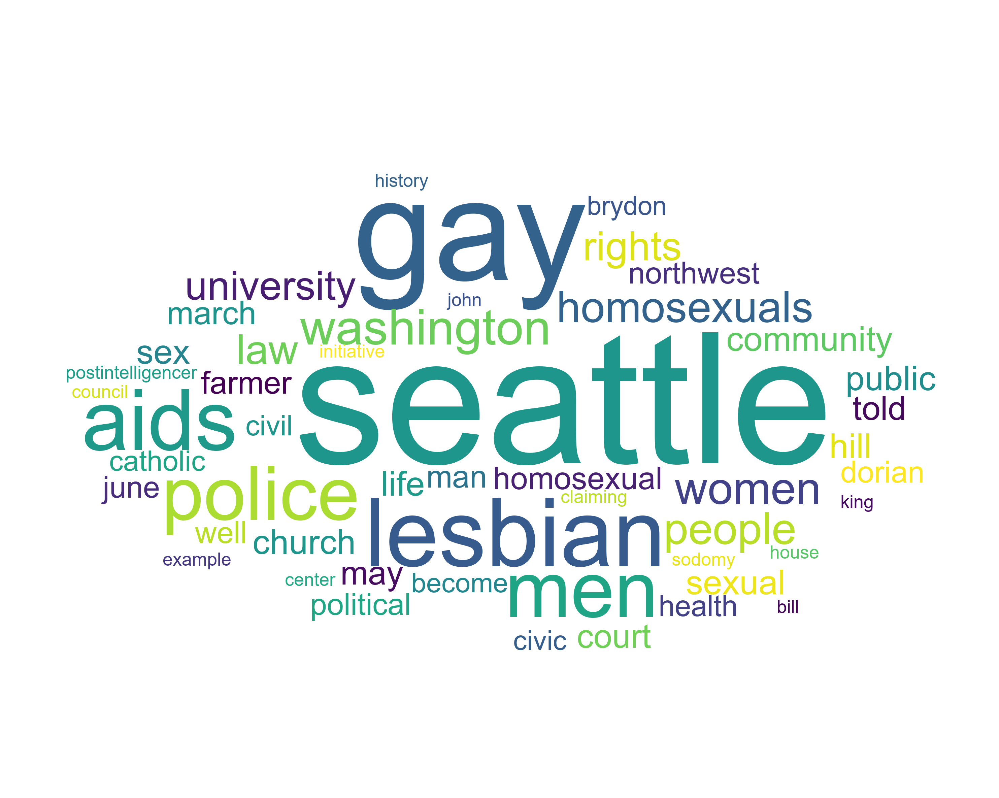

# Practical Exercise 5: Place context analysis using Natural Language Processing

**Meeting:** Wednesdays, 2:30 - 5:20, SMI 109

**Instructor:** Bo Zhao, SMI 416B, Office hours by appointment

**Contact:** 206.685.3846, zhaobo@uw.edu, jakobzhao (skype/wechat)

In this practical exercise, you are expected to use Natural Language Processing to explore a book author's sense of place about Seattle. Natural Language Processing (NLP), as a typical machine learning algorithm, aims to inteprete the context of a large text corpora with the support from insteading of a human being. Obviously, NLP can learn a large amount of text with ease, and can summarize its major context using multiple functions and analyses. Sense of place indicates an individual's perception, emotion,  or altitude towards a place. If an individual has recorded one's sense of place, it is possible to interprete the author's sense of place to process the record using NLP. Below, we will explore Gary L. Atkins's sense of place about Seattle. To do so, we will mainly use NLP to process his book entitled *Gay Seattle*. Specificially, we plan to explore multiple perspectives of Gary's sense of place. For example, we would like to get a general picture about his impression of Seaettle using word cloud, and then plot the spatial dimension of Gary's perception of `Seattle`, and then try to visualize Gary's sense of palce using network analysis. Let us get started!

## 1.  Environment Setup

This execerise will be conducted in a python programming environment. Before impelmenting this exerciese, a few python libraries are needed. To install, please execute the following line on command prompt or terminal.

```powershell
pip install PyMuPDF
pip install tika
pip install gensim
pip install spacy
pip install nltk
pip install wordcloud
pip install numpy==1.17.0
python -m spacy download en_core_web_sm
```

To make sure NLTK run property, you need to download the NLTK corpora dataset.Run the Python interpreter and type the commands.

```Python
>>> import nltk
>>> nltk.download()
```

In addition to configure the python environment, install Gephi and QGIS 3.

Gephi is an open-source network analysis and visualization software package written in Java on the NetBeans platform. Gephi has been used in a number of research projects in academia, journalism and elsewhere, for instance in visualizing the global connectivity of New York Times content and examining Twitter network traffic during social unrest along with more traditional network analysis topics. Gephi is widely used within the digital humanities (in history, literature, political sciences, etc.), a community where many of its developers are involved.


## 2. Reading and Preprocessing PDF files

 In this section, we need to read all the pdf files of the book *Gay Seattle*, please download all the pdf files from the Google drive and store them in the folder named as `gay-seattle` under the `assets` folder. Additionally, create a folder called `delFrontPage` under the same folder. After migrating files, we need to delete the front page of each pdf file since this page, containing the meta data of the pdf file, is irrelevant to the maintext of this book. Then, the python script recognizes the text of each pdf file using a python library `pika`. In the end, all the text will be stored in an text file named `gay-seattle.txt`.
#### 010_text_reader.py
As you may notice, every PDF file you downloaded starts with the same page, which contains information about the book's publication. However, we do not want to include such data in our text analysis. Therefore we will delete all the first pages using the following code:

```Python
# delete the front page of each pdf file
for pdf in pdfs:
    pdfHandle = fitzOpen(bookPath + '/' + pdf)
    pages = list(range(pdfHandle.pageCount))
    pages.pop(0)
    pdfHandle.select(pages)
    pdfHandle.save(delFrontPagePath + '/' + pdf)
    pdfHandle.close()
```

In order to read text data from PDF, we use `parser` in `tika` library:

```Python
# read the content of each pdf and make a text file contains the entire book content.
content = parser.from_file(delFrontPagePath + '/' + pdf)['content']
    try:
        print(content)
        with open(txtPath, 'a', encoding='utf8') as output:
            if content is not None:
                output.write(content)
    except AttributeError as error:
        print(error)
```

Now we have text data extracted and stored in `gay-seattle.txt`. Before we start analyzing the text, we need to 'clean' the data.
####020_text_preprocess.py
You may notice that in `gay-seattle.txt` there are a lot of white spaces and empty blanks between lines. Lets delete them.

```Python
# delete the white spaces
txt = " ".join(txt.split())
```

We also need to convert all the letters to lowercase. This is because during text processing, same words with different capitalization will be counted independently. For example, `Seattle`, `seattle`, and `SEATTLE` all have the same meaning and we want to treat them as one word instead.

```Python
# Convert text to lowercase
txt = txt.lower()
```
####030_model_builder.py
Now we have preprocessed data ready to use. Before we can create language model for natural language processing, we need to remove unwanted characters and words from our text data. This includes non-letters and stop words (the, is, not, etc...).

```Python
def review_to_wordlist(review, remove_stopwords=False):
    # Function to convert a document to a sequence of words,
    # optionally removing stop words.  Returns a list of words.
    #
    # 1. Remove HTML
    # review_text = BeautifulSoup(review, 'html5lib').get_text()
    #
    # 2. Remove non-letters
    review_text = re.sub("[^a-zA-Z]", " ", review)
    #
    # 3. Convert words to lower case and split them
    words = review_text.lower().split()
    #
    # 4. Optionally remove stop words (false by default)
    if remove_stopwords:
        stops = set(stopwords.words("english"))
        words = [w for w in words if not w in stops]
    #
    # 5. Return a list of words
    return words
```
After that, we will tokenize each sentences as well as each words using tokenizer provided by NLTK module.
```Python
# Define a function to split a review into parsed sentences
def review_to_sentences(review, tokenizer, remove_stopwords=False):
    # Function to split a review into parsed sentences. Returns a
    # list of sentences, where each sentence is a list of words
    #
    # 1. Use the NLTK tokenizer to split the paragraph into sentences
    raw_sentences = tokenizer.tokenize(review.strip())
    #
    # 2. Loop over each sentence
    sentences = []
    for raw_sentence in raw_sentences:
        # If a sentence is empty, skip it
        if len(raw_sentence) > 0:
            # Otherwise, call review_to_wordlist to get a list of words
            new_sentence = review_to_wordlist(raw_sentence, remove_stopwords)
            if new_sentence != [] and new_sentence != [u'none']:
                sentences.append(new_sentence)
    # Return the list of sentences (each sentence is a list of words,
    # so this returns a list of lists
    return sentences
```
Finally, we can train our own language model using the data we have been preparing. We will also save the created model for later use.

```Python
# train a model
    print("creating a model...")
    model = Word2Vec(doc, workers=cpu_count())
    model.save(modelPath)
    print("completed!")
```
####031_model_test.py
Now, with the model we have created, we can get a list of words that are closer to 'seattle' or get a similarity distance between words of your choice.
```Python
# test model
print('loading model...')
model = Word2Vec.load("assets/gay-seattle.w2v")
print("seattle", model.wv.most_similar('seattle', topn=50))
print(model.wv.distances('seattle', ('news', 'june', 'times', 'march')))
```
Carefully examine what words appears and think about why these words are the 'closest' words. You may change the input word to see what kind of words are closer each other.
## 3. Making a Wordcloud
####040_word_cloud_creator.py
Now let's visualize the context of our data using word frequencies and wordcloud.

In previous part, we have preprocessed our text data, but we need a bit more of cleaning our data. We will remove punctuations and numbers from our text, because we do not want to include them in our wordcloud.

```Python
# Remove numbers
txt = re.sub(r'\d+', '', txt)

# Remove punctuation
txt = re.sub(r'[^\w\s]', '', txt)
```

Moreover, we will replace some of the words with their root form to avoid having similar words in our data. In this example, we will replace 'gays' with 'gay', 'lesbians' with 'lesbian', and etc...

```Python
txt = txt.replace("gays", "gay").replace("lesbians", "lesbian").replace("seattles", "seattle").replace("citys", "city")
```

We can also modify the list of stopwords to remove from our original text. Let's remove some of the frequently appearing words that are irrelevant to our context.

```Python
stopwords = set(STOPWORDS)
commonwords = {"time", "one", "began", "among", "another", "see", "part", "many", "day", "day", "way", "times",
               "still", "news", "three", "came", "became", "made", "wanted", "seemed", "made", "now", "society",
               "ing", "time", "first", "new", "called", "said", "come", "two", "city", "group", "state", "year",
               "case", "member", "even", "later", "month", "years", "much", "week", "county", "name", "example"
               "well", "members", "us", "say", "s"}
stopwords.update(commonwords)
```
Before producing wordcloud, let's take a look at word frequency table. Following piece of code prints out frequency table for us.

```Python
# tokenize and calculate the word frequencies
tokens = nltk.tokenize.word_tokenize(txt)
fDist = FreqDist(tokens)
print(fDist.most_common(20))

# remove the stop words and common words
filtered_fDist = nltk.FreqDist(dict((word, freq) for word, freq in fDist.items() if word not in stopwords))

print(filtered_fDist)
filtered_fDist.plot(20)
```
Here is a preview of the word frequency graph we obtained:

Let's also produce wordcloud. `wordcloud` module lets us create a wordcloud using frequency data. We can also set a mask image to change what shape the wordcloud will form.
```Python
print("generating wordcloud...")
mask_array = npy.array(Image.open("img/cloud.jpg"))
wc = WordCloud(font_path='arial', background_color="white", max_words=50, prefer_horizontal=1, mask=mask_array, scale=3, stopwords=stopwords, collocations=False)
wc.generate_from_frequencies(filtered_fDist)
wc.to_file(wcPath)
print("completed!")
```
The generated wordcloud image is saved in `img` folder with fike name `gay-seattle.png`. Here is the preview. We now have a better sense of what the context of this paper is.


## 4. Spatial dimension of sense of place
####051_spatial_dimension.py
Now, let's analyze this text from another aspect: spatial dimension of sense of place. A sense of place is a characteristic that some geographic places have and some do not, while to others it is a feeling or perception held by people. It is often used in relation to those characteristics that make a place special or unique, as well as to those that foster a sense of authentic human attachment and belonging. Spatial simension of sense of place is a similar concept except that it is focused on spatial connections and relationship with other places.

To perform this analysis, we will use a NLP package `spaCy` and its provided language model. We care going to use a language model called `en_core_web_sm`, but before we can use them, we need to download it manually using terminal.

```terminal
python -m spacy download en_core_web_sm
```

Then, we load the language model and make a NLP object used to create documents with linguistic annotations.

```Python
nlp = spacy.load("en_core_web_sm")
nlp.max_length = len(txt)
my_doc = nlp(txt)
```

We also remove stopwords and lemmatize each word. Lemmatization is a process of grouping together the inflected forms of a word so they can be analysed as a single item, identified by the word's lemma, or dictionary form.

```Python
# removing stopwords
print("removing stop words...")
filtered_sent = []
for word in my_doc:
    if not word.is_stop:
        filtered_sent.append(word)
print("Filtered words: ", filtered_sent)

# lemmatization
print("lemmatizing...")
lemma_sent = []
for word in filtered_sent:
    lemma_sent.append(word.lemma_)
print("lemmatized data: ", lemma_sent)
processedTxt = " ".join(lemma_sent)
processedDoc = nlp(processedTxt)
```
`spaCy` provides a nice feature called entity detection, which tells us what entity each term belongs to. For example, 'John' is person, 'supreme court' is organization, and 'seattle' is place. When we created our NLP object, each words are already tagged according to their entity. We are only interested in locations and places, which are tagged `GPE`, which refer to geopolitical entity. We will extract such vocabularies from our text.

```Python
geoTxt = ""
for ent in processedDoc.ents:
    print(ent.text, ent.start_char, ent.end_char, ent.label_)
    if ent.label_ == "GPE":
        geoTxt += ent.text.replace(" ", "") + " "
```
Then, we tokenize and save the calculate the word frequencies to `gay-seattle-places.csv` for geocoding.
```Python
tokens = nltk.tokenize.word_tokenize(geoTxt)
fDist = FreqDist(tokens)
with open("assets/gay-seattle-places.csv", "w", encoding="utf8") as fp:
    for item in fDist.most_common(300):
        try:
            fp.write("%s, %d\n" % (item[0].replace("county", " county").replace("state", " state").replace("city", " city"), item[1]))
            print(item)
        except TypeError as error:
            pass
print("finished!")
```


## 5. Semantic dimension


## Deliverable


## References
* Thrush, C., 2017. Native Seattle: Histories from the crossing-over place. Accessed from https://muse.jhu.edu/book/10411. University of Washington Press.

* Atkins, G., 2011. Gay Seattle: Stories of exile and belonging. Accessed from https://muse.jhu.edu/book/40703. University of Washington Press.
